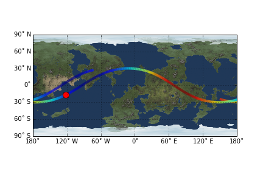

# wernher

A toolkit for flight control and orbit analysis specific to [Kerbal Space Program](https://kerbalspaceprogram.com) using the excellent [kRPC](http://forum.kerbalspaceprogram.com/threads/69313-WIP-kRPC-A-language-agnostic-Remote-Procedure-Call-server-for-KSP) addon (see [kRPC on github](https://github.com/djungelorm/krpc/releases)) through the corresponding python [krpc client module](https://pypi.python.org/pypi/krpc).

An orbit around Dres. The vessel is the red dot and periapsis is the yellow dot. Relative altitude is indicated by the color of the line.


# Quick Start

The primary object is the ``Orbit`` class. It can be initialized from the active vessel using [kRPC](http://forum.kerbalspaceprogram.com/threads/69313-WIP-kRPC-A-language-agnostic-Remote-Procedure-Call-server-for-KSP) like so::

```python
import krpc, wernher

def orbit_from_krpc_orbit(ksc,obt):
    body = wernher.CelestialBody(
        name = obt.body.name,
        gravitational_parameter = obt.body.gravitational_parameter,
        equatorial_radius = obt.body.equatorial_radius,
        rotational_speed = obt.body.rotational_speed)
    return wernher.Orbit(
        t0 = ksc.ut,
        i  = obt.inclination,
        Ω  = obt.longitude_of_ascending_node,
        ω  = obt.argument_of_periapsis,
        e  = obt.eccentricity,
        a  = obt.semi_major_axis,
        M0 = obt.mean_anomaly_at_epoch,
        body = body)

conn = krpc.connect(name='laptop0', address='192.168.1.2')
ksc = conn.space_center
vessel = ksc.active_vessel
orbit = orbit_from_krpc_orbit(ksc,vessel.orbit)
```

Now you can find the altitude of the vessel 1 hour in the future::

```python
km = 1000
R = orbit.body.equatorial_radius
t0 = orbit.epoch
Δt = 1*60*60
r = orbit.radius_at_time(t0 + Δt)
print('altitude in 1 hour:',(r-R)/km,'km')
```

##Ground Tracks

Ground tracks require the underlying maps to be downloaded. you can run the script found in the ``map_images`` directory to scrape the website kerbalmaps.com until I can find suitable storage for such files. It will download images of the lowest three resolutions for every planet and moon in KSP along with biome and slope maps.

Here we show an example of how to plot the ground track over Kerbin using the same preamble as above::

```python
import wernher
from matplotlib import pyplot
import numpy as np

π = np.pi
deg = π/180
km = 1000

body = wernher.CelestialBody(
    name = 'kerbin',
    gravitational_parameter = 3.5316e12,
    equatorial_radius = 600*km,
    rotational_speed = 2*π/21600)
orbit = wernher.Orbit(
    t0 = 0,
    i  = 30*deg,
    Ω  = 0*deg,
    ω  = 15*deg,
    pe_alt  = 100*km,
    ap_alt  = 200*km,
    M0 = -45*deg,
    body = body)

# ground track consists of 200 points
npoints = 200

# start in the past by 1/4 of the orbital period
tmin = orbit.epoch - 0.25*orbit.period

# plot 1.5 periods of ground track
tmax = tmin + 1.5*orbit.period

# array of times - evenly spaced
tt = np.linspace(tmin,tmax,npoints)

# array of lattitude and longitudes, converted to degrees
lat = orbit.latitude_at_time(tt) / deg
lon = orbit.longitude_at_time(tt) / deg

# calculate radius and normalize to the range [0,1]
r = orbit.radius_at_time(tt)
rmin,rmax = r.min(),r.max()
r = (r - rmin) / (rmax - rmin)

# create figure and add map view, track and position marker
fig,ax = pyplot.subplots()
mview = wernher.MapView(orbit.body)
mview.zoomlevel = 1
mview.plot_basemap(ax)
tk = wernher.MapView.plot_track(ax,lat,lon,r)
mk = wernher.MapView.plot_marker(ax,
    orbit.latitude_at_epoch/deg,
    orbit.longitude_at_epoch/deg)

# show plot in new window
pyplot.show()
```

Which produces the image:


